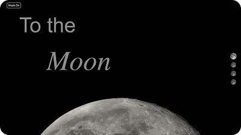
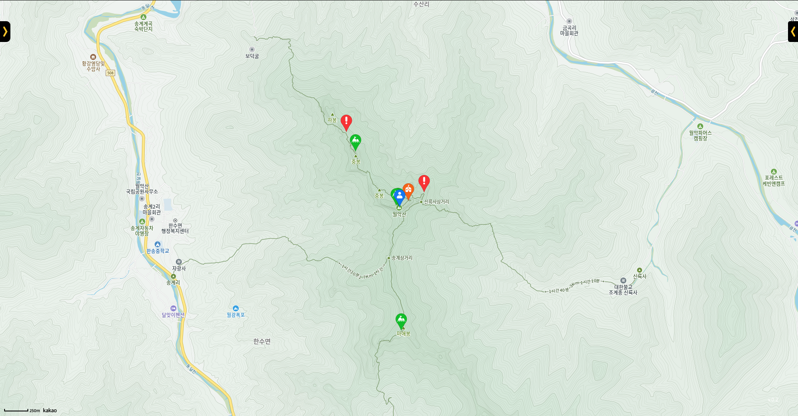
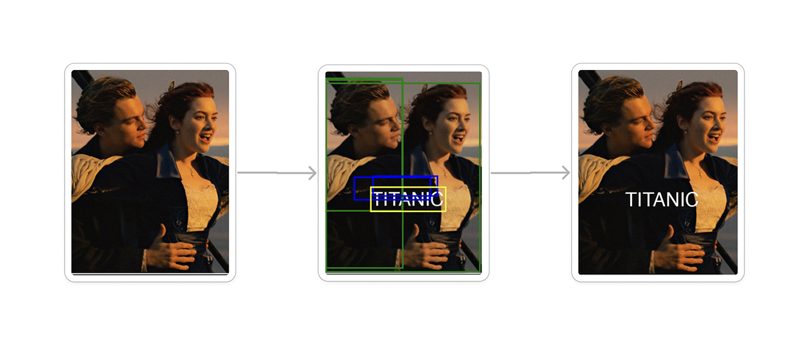

# 개발하는 UX 디자이너 문지욱입니다.

---

## Tech Stack

<table>
  <tr>
    <td><strong>Productivity</strong></td>
    <td>
      
      
      
      
    </td>
  </tr>

  <tr>
    <td><strong>Web (Frontend)</strong></td>
    <td>
      
      
      
      
    </td>
  </tr>

  <tr>
    <td><strong>Web (Backend & Infra)</strong></td>
    <td>
      
      
      
      
      
      
      
      
      
      
    </td>
  </tr>

  <tr>
    <td><strong>Data &amp; AI</strong></td>
    <td>
      
      
      
      
      
      
      
      
      
    </td>
  </tr>

  <tr>
    <td><strong>Testing</strong></td>
    <td>
      
      
    </td>
  </tr>
</table>

---

## Projects

  

     
    <strong>🌙 To The Moon</strong>
  

  
    

  

     
    <strong>⛰️ Safe Hiking Tour</strong> 
  

  
  <!--
    
  
  

     
    <strong>🎬 Poster Generator</strong> 
  

  -->

