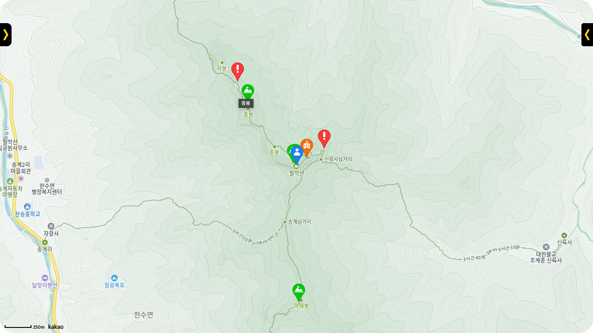

# Hi, I'm Jiuk

저는 영화를 좋아하는 마음에서 시작해, 사용자와 콘텐츠를 연결하는 서비스 개발에 힘써왔습니다. 

코로나 시기 독립영화제를 온라인으로 개최하며 기획과 개발, 소통 전반을 직접 맡았고, 실제 사용자 니즈를 반영해 방향을 조정한 경험은 문제 해결자로서의 성장을 이끌었습니다. 

이후에는 등산 위험지역 웹지도, 챗봇 추천 서비스, 프론트엔드 성능 최적화 등 다양한 프로젝트를 통해 사용자의 불편을 해결해 왔습니다. 

기획부터 프로토타입 제작, 피드백 기반 개선까지 전 과정을 경험한 저는, 기술을 수단으로 삼아 더 나은 사용자 경험을 만드는 실무형 인재로 성장하고자 합니다.

---

## Tech Stack

<table>
  <tr>
    <td><strong>Frontend</strong></td>
    <td>
      
      
      
    </td>
  </tr>
  <tr>
    <td><strong>Backend</strong></td>
    <td>
      
      
      
      
    </td>
  </tr>
  <tr>
    <td><strong>AI / ML</strong></td>
    <td>
      
      
      
    </td>
  </tr>
  <tr>
    <td><strong>Tools</strong></td>
    <td>
      
      
    </td>
  </tr>
</table>

---

## Projects

  

     
    <strong>🌙 To The Moon</strong>
  

  
    

  

     
    <strong>⛰️ Safe Hiking Tour</strong> 
  

  
  <!--
    
  
  

     
    <strong>🎬 Poster Generator</strong> 
  

  -->

